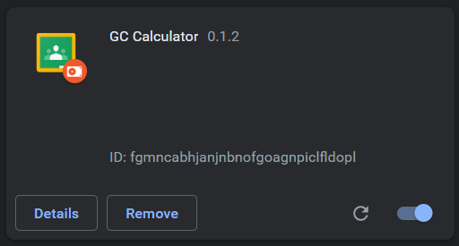
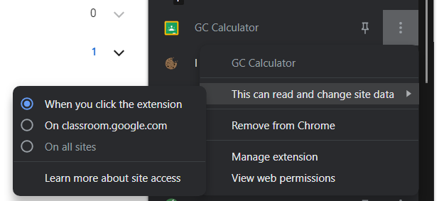
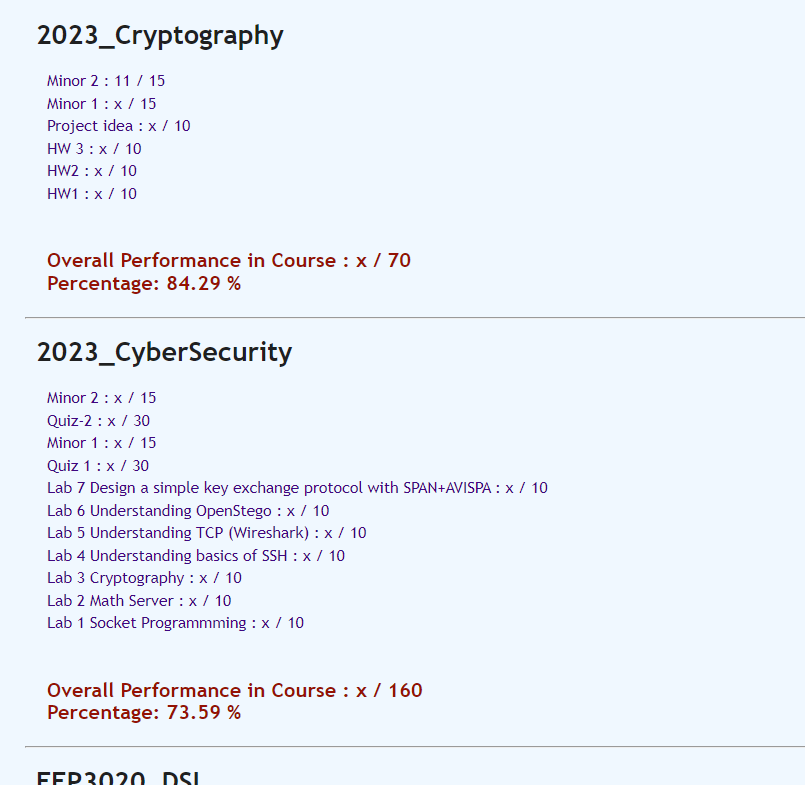

# GC Course-wise Marks Calculator Extension

An extension to calculate total marks obtained and overall percentage for each of the courses enrolled on Google Classroom.

> Project Status : Ongoing

## Steps to Load Extension

- Clone this repo using `git clone https://github.com/yashmaniya0/GC-Marks-Calculator.git`
- Go to Chrome Extensions (🧩) -> Manage Extensions
- Click on Load Unpacked and set the path to root directory of this extension (cloned repo directory)
- Following extension will appear. Enable extension if not enabled already.

- Complete following settings from Google Extensions:

## Final Steps

- Open Google Classroom -> To - Do list -> Done tab (https://classroom.google.com/u/0/a/turned-in/all)
- Click on the GC Calculator Extension from the extensions list to activate the script. (Reload site if it asks for)
- Wait for few seconds till the data is loaded and calculated. (Meanwhile you will see dropdowns getting clicked, if not reload website and click extension)
- Course-wise marks will be shown in minimalistic UI.
